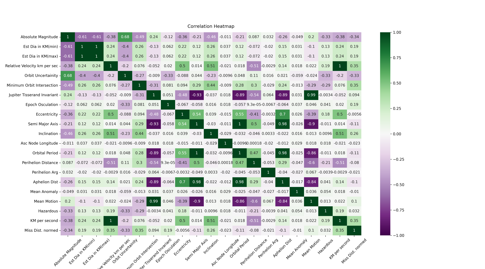
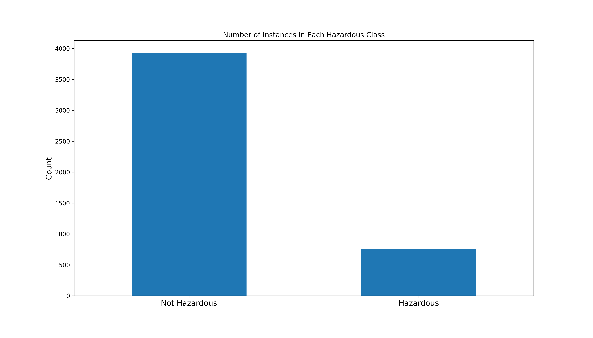

# Asteroid-Classification

NASA's JPL maintains an up-to-date dataset on Asteroids that could potentially be hazardous to Earth. Using my background in astrophysics, I thoroughly analyze and clean the dataset to perform binary classification.

## Overview

The dataset used for this project contains information of Near-Earth Objects (NEOs). NEOs are comets and asteroids that have been gravitationally bound by a large body, like a planet, and are bound in an orbit. If a comet's or asteroid's are within 1.3 astronomical units (AU) of the sun then they are categorized as NEOs. Much funding has been invested to observe such objects as a gravitational 'nudge' can be strong enough to alter the path that will put it in path with a potential collision with Earth. Although most objects in this list aren't big enough to call for concern, we can still use this dataset to learn how to categorize them. The dataset collected contains morphological and physical descriptions such as estimated radius and velocities. Using my domain knowledge, I apply physics concepts that govern kepplerian orbits to analyze and clean the data, and end by performing binary classification.

We start by performing exploratory data analysis (EDA). We begin by removing non-descriptive and non-numerical features such as dates and catalog names as they serve no purpose in our analysis. We remove redundant data, and convert physical features to SI units for uniformity and to stay in convention with physics based data analysis. We then analyze the remaining features using a correlation heatmap as seen on figure 1. Using kepplers laws, we perform feature engineering and remove features that are already embedded in the data.

|  |
|:--:|
| <b>Fig 1 - Correlation heatmap showing the relationship among all instances within the raw data. </b>|

After performing our data cleaning, we observe that our dataset is imbalanced as most of the instances in our dataset belong to one class, this can be confirmed by our count chart in figure 2. With this in mind, we approach our classification problem differently as we cannot rely on accuracy as a metric. Using a Decision Tree, Random Forest and a Naive Bayes classifier, we train our models. Using F1-score and Mathews Correlation Coefficient (MCC) to determine model performance, we find that the Decision Tree and Random Forest perform best and are robust models capable with dealing with unseen data as they both outperform the baseline of 88% by reaching an F1-score above a 95% and an MCC above 94% with the test set.

|  |
|:--:|
| <b>Fig 2 - Count chart to show feature imbalance. </b>|

## Notes

The entire project was done using google colab's jupyter notebooks. The notebook itself contains more in depth physics background as well as comments throughout to provide insight on the decision making process.

## Data

I collected the data from [JPL's](http://neo.jpl.nasa.gov/) official website and the `.csv` file can be found on this repository as well.
